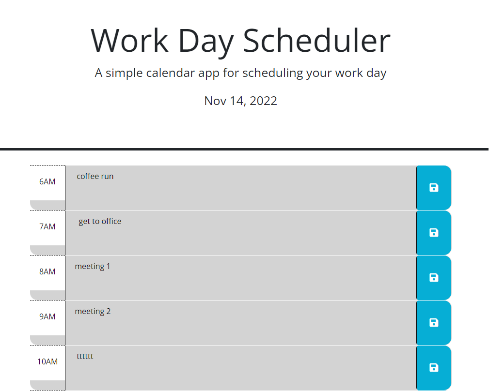

# work-day-scheduler

## Description
A simple 12 hour schedule handler that will store events and update based on time!

## Methods
- Any user created events are saved in local storage
- Upon loading, any events saved are loaded to the page
- When loaded, script will run to check the current hour and change the appearance of the page

## Mock-Up

## Check it out here!
https://eabaynes.github.io/work-day-scheduler